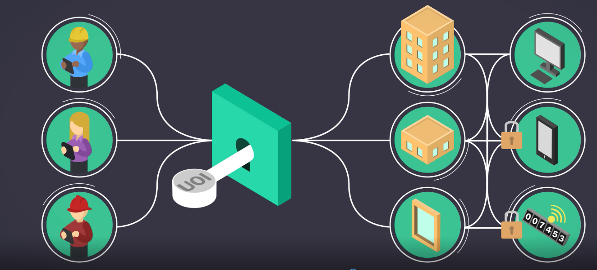
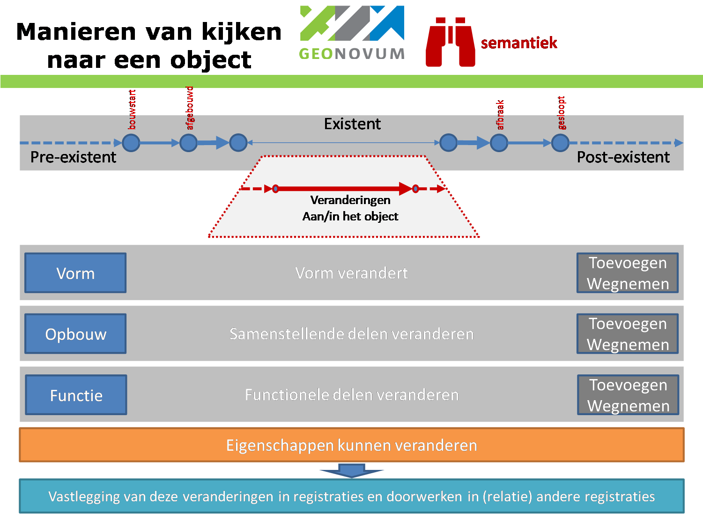
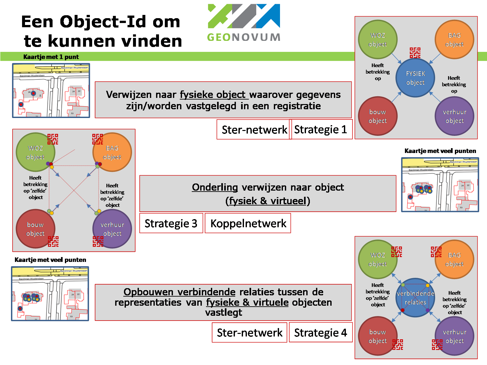
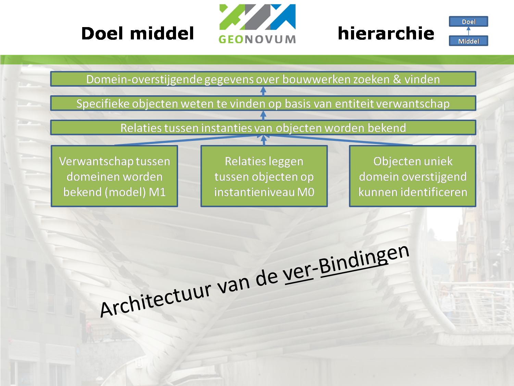
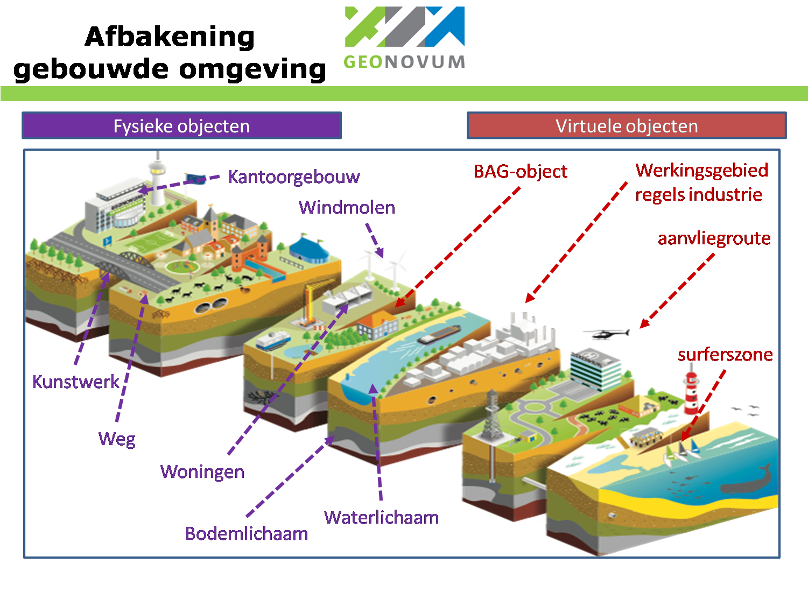
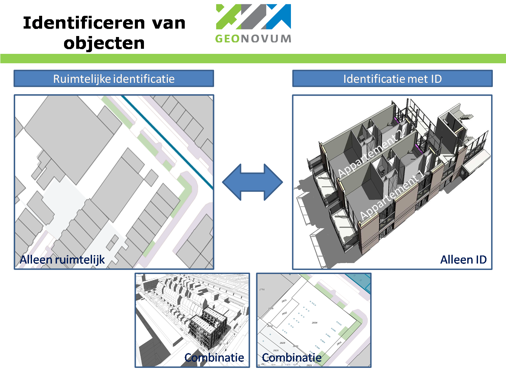

## Inleiding

Onderwerp van dit rapport is een UOI-code én een UOI-code-stelsel. We nemen u in
hoofdstuk 1 ook mee in onze zoektocht rondom het hoe en waarom van een UOI-. Ook
schetsen we onze constatering dat het ontstaan van een UOI-code stelsel als een
stuk faciliterende infrastructuur zou mogen worden afgewogen. Het UOI-code
stelsel fungeert dan als voor domein-overstijgende infrastructuur voor het
vinden van objectgegevens. We beschrijven tevens het doel van een UOI-code voor
de gebouwde omgeving. Ook komt de definitie van de gebouwde omgeving in deze
context ter sprake. Daarnaast worden drie principes geïdentificeerd om
domein-overstijgend objecten te kunnen zoeken, vinden en interpreteren.
Tenslotte worden de vijf onderkende alternatieven voor een UOI-code-stelsel, op
hoofdlijnen benoemd.

### Leeswijzer

De inhoud van het rapport is soms technisch of zo u wilt theoretisch van aard
omdat het hier om fundamentele domein overstijgende principes gaat. De lezer die
alleen een algemeen beeld wil hebben kan in principe volstaan met de
samenvatting. Voor de meer in detail of techniek geïnteresseerden is meer detail
in deze rapportage beschreven en zijn een serie bijlages opgenomen. Hen raden we
aan het [1e onderzoeksrapport](https://fibree.org/uoi-nl/) eerst te lezen.

We beginnen dit hoofdstuk 1 met een beschrijving van het fenomeen UOI-code als
identificator van objecten in de gebouwde omgeving. We nemen u mee in onze
zoektocht naar het hoe en waarom van een UOI-code. We laten u zien dat de
UOI-code aan een informatie-object wordt toegekend en dat een informatieobject
een domein specifieke manier van kijken naar een object omvat. Ook nemen we u
mee in het onderscheid tussen fysieke en virtuele objecten.

Al snel nemen we u mee in de constatering dat de UOI-code een vorm van domein
overstijgend verbinden mogelijk maakt, maar dat het beantwoorden van
domein-overstijgende vragen meer vraagt. Daartoe bouwen we een doelenboom op,
waarmee we laten zien wat er nodig is om te kunnen identificeren, relateren en
semantisch te interpreteren.

We schetsen de samenhang met de SOR (Samenhangende Objecten Registratie) en
geven een definitie van de objecten in de gebouwde omgeving. We verdiepen op de
principes identificeren, relateren en semantisch interpreteren en introduceren
de verwantschaps-ontologie.

We sluiten de inleiding af met het benoemen van de gehanteerde ontwerpprincipes
en onderkende alternatieven voor een UOI-code-stelsel

In hoofdstuk 2 wordt het object en haar verschijningvormen nader toegelicht.
Hier wordt ook het concept van een verbinder geïntroduceerd. Daarna volgt een
beknopt overzicht van de onderkende componenten van het UOI-code-stelsel en de
primaire werking van een UOI-code stelsel.

Er volgt daarna in paragraaf 2.4 een uitwerking op het aspect *identificeren*
met de UOI-code. Hier komen ook de beelden over het uitgifteregime aan de orde.
We duiden in deze paragraaf ook ons vermoeden dat UOI-codes alleen aan zogeheten
knooppunt-entiteiten behoeven te worden gegeven.

In paragraaf 2.5 gaan we nader in op het principe van *relateren* van objecten
die aangeduid zijn met een UOI-code. We geven nader inzicht in de linksets die
hierdoor ontstaan.

Daarna wordt in paragraaf 2.6 het principe van *semantisch interpreteren* via
onderkende verwantschappen op entiteitniveau toegelicht. Hier introduceren we de
verwantschapsontologie en positioneren de kennisgraaf als hulmiddel daarbij.

In paragraaf 2.7 leggen we uit dat een formeel UOI-code-stelsel met
functionaliteit voor identificeren, relateren en semantisch interpreteren waarde
heeft voor hen die antwoorden op domein-overstijgende vragen willen kunnen
vinden.

Daarna komen in paragraaf 2.8 en 2.9 de faciliterende componenten van het
UOI-code-stelsel en het garanderen van digitale toegang van de onderkende
registraties van het UOI-code-stelsel aan de orde. Tenslotte worden in paragraaf
2.10 de organisatorische borging van het beheer en het in stand houden van het
UOI-code-stelsel op hoofdlijnen beschreven.

*De lezer heeft nu een beknopt beeld van wat het UOI-code-stelsel beoogt te
kunnen bieden, uit welke componenten het UOI-code-stelsel bestaat en hoe de drie
aspecten identificeren, relateren en semantisch interpreteren daar een rol in
spelen.*

In hoofdstuk 3 worden daarna de oplossingsalternatieven met de werknamen (1)
*Sober UOI-code-stelsel*, (2) *UOI-code-stelsel met verwantschapsregistratie*,
(3) *UOI-code stelsel met relatieregistratie* en (4) *Formeel UOI-code stelsel*
geduid en uitgewerkt. Hier komen voor elk van de alternatieve oplossingen de
karakteristieken aan bod. Ook wordt het nul-alternatief (geen UOI-code-stelsel)
toegelicht.

In hoofdstuk 4 gaan we in het voorjaar van 2021 aan de hand van enkele
praktijkgevallen laten zien hoe de UOI-code, de verwantschapsontologie en het
relateren kan verlopen. Dit deel is bij de 1e consultatie nog niet beschikbaar.

In de bijlagen vindt u een lijst van geraadpleegde documenten en geraadpleegde
experts maar ook nadere toelichting op het mechanisme van filiatie, de eisen aan
een identificerende code zoals de UOI-code, de logica en werking van de
kennisgraaf en ruimtelijke analyse volgens het mechanisme van het omhullende
volume.

###  Zoektocht naar het hoe en waarom van een UOI-code

Het project “Regie op Bouwgegevens” beoogt de informatievoorziening binnen de
bouwsector (publiek & privaat) te verbeteren. De Unieke Objectidentificator
(UOI), richt zich daarbinnen specifiek op het ontwikkelen van een unieke
objectidentificatie. Deze UOI-code moet het mogelijk maken om gegevens op
verantwoorde en betrouwbare wijze te kunnen registreren, uitwisselen (delen) en
koppelen aan andere gegevens. Onderliggend wordt hiermee beoogd de gegevens over
objecten in de gebouwde omgeving domein-overstijgend te kunnen delen, waarbij de
UOI-code het identificeren verzorgt.

Dit document bevat de onderzoeksresultaten van een verdiepend onderzoek naar de
(on-) mogelijkheden van het gebruik van een UOI-code om objecten in de gebouwde
omgeving persistent uniek te kunnen identificeren. “In een eerdere fase (de
eerste onderzoeksfase) is een eerste opzet ontworpen door een consortium van
Fibree, Kadaster en BZK. Bij de huidige (de tweede onderzoeksfase) wil BZK ook
Geonovum betrekken om het ontwerp van de UOI beter af te stemmen op bestaande
standaarden, zoals NEN 3610, NEN 2660 en NTA 8035, en de manieren waarop deze
omgaan met identificatie (zoals o.a. toegepast bij een aantal basisregistraties)
en op de ideeën ten aanzien van identificatie vanuit DiS Geo (de samenhangende
objectenregistratie, SOR).

We zijn het ontwerpproces eind 2020 naar een UOI-code ingestapt met de bagage
zoals opgetekend in het Fibree-rapport van mei 2020. Daarin wordt vooral
gefocussed op de vorm van de UOI-code als unieke object identificator en de
meerwaarde die bereikt kan worden wanneer alle objecten in de gebouwde omgeving
een UOI-code hebben respectievelijk krijgen.

<figure id="image15">
    
    <figcaption>UOI-code als sleutel tot gegevens over de gebouwde omgeving (bron Fibree)</figcaption>
</figure>

Fibree heeft ook een [filmpje](https://fibree.org/uoi-nl/) gemaakt die de
beoogde werking van de UOI-code toelicht.

Het onderzoeksteam van Geonovum en Kadaster heeft na de validatie van het eerste
onderzoekrapport geconcludeerd dat het succesvol delen en kunnen gebruiken van
gegevens over objecten uit de gebouwde omgeving meer vraagt dan alleen een
unieke objectidentificatie. De ontvanger moet gegevens ook kunnen relateren aan
eigen informatie-objecten en gegevens en ze semantisch kunnen interpreteren.
Deze aanvliegroute werd door het ingestelde UOI-expertteam beaamd. Dit inzicht
heeft in overleg met de opdrachtgever geleid tot een ruimere vraagstelling,
waarin naast de identificatie (UOI-code) ook de semantische interpretatie via
een verwantschapsontologie en een strategie voor het vinden van de relatie op
instantieniveau zijn meegenomen. **Daarmee is de vraag over de UOI-code verruimd
tot een over een UOI-codestelsel.**

**Validatie**

Via een validatie hebben we ons afgevraagd welke onderwerpen nog niet toereikend
in ogenschouw genomen waren en nader onderzoek vereisen. Daaruit kwamen de
volgende aspecten voor nader onderzoek naar voren:

-   Welke alternatieven zijn er voor de UOI-code

-   Welke soort objecten krijgen mogelijk een UOI-code.

-   Wat is de samenhang met het stelsel van geo-basisregistraties

-   Welke logica bestaat er tussen UOI-code als middel en de doelen daarbij
    zoals semantisch begrijpen

-   Wat levert een UOI-code voor belanghebbenden nu op

-   Welke alternatieven zijn er binnen een UOI-code oplossing

-   Hoe werkt het UOI-code-uitgifte mechanisme, -regime en de governance
    daarbij.

We hebben ons als onderzoeksteam daarbij ook een aantal principiële vragen
gesteld om de hiervoor genoemde vragen te kunnen gaan beantwoorden. Daarom
beschrijven we die hierna.

**Identificatie om te kunnen relateren**

Identificatie van objecten ondersteunt het proces van relateren van objecten.
Objecten waarvan gegevens zijn vastgelegd in uiteenlopende registraties. Mensen
en organisaties willen steeds vaker gegevens uit de ene domein-registratie
kunnen verbinden met die uit andere domein-registraties. Daartoe zoeken ze een
sleutel waarmee de registraties onderling te verbinden zijn. Wanneer die sleutel
éénduidig de relatie tussen objecten in registraties legt, kan over registraties
heen gezocht en gevonden worden. Dat veronderstelt wel dat we die registraties
kunnen vinden en benaderen[^10].

[^10]: Zie ook het
[5-sterrenmodel](https://www.open-overheid.nl/vraagbaak-open-data-5-sterren/)
(Tim Berners Lee)

**Semantisch begrijpen**

Dat veronderstelt ook dat er semantisch overeenstemming is te bereiken over het
feit dat de objectdefinitie van het sleutelobject in het ene domein enigszins
overeenkomt met de objectdefinitie van het sleutelobject in de andere
registraties. Dat kan de mens achterhalen door onderzoek en afstemmen. Wanneer
een machine dat wil doen, moeten die objectdefinities ook vindbaar en
interpreteerbaar zijn voor de machine.

**Aspecten om in acht te nemen**

Na een eerste inventarisatie naar aspecten die in acht genomen moeten worden bij
het ontwerpen van een UOI-code-stelsel, voor zowel fysieke als virtuele[^11]
objecten in de gebouwde omgeving, kwamen de onderstaande aspecten van de kijk op
een object naar voren:

[^11]: Zie definitie fysiek en virtueel object en gehanteerde synoniemen in
paragraaf 2.1

-   **Semantiek (objectdefinitie en afbakeningsregels)**

-   **Vorm** (vastgelegd in geometrieën) (veelal bepaald door de
    domeinspelregels zoals definitie)

-   **Opbouw** (vastgelegd in (de)compositie structuren)(topologische relaties)

-   **Functie** (vervult een functie in het geheel gezien door de domeinbril
    zoals in System Engineering zoals gevel-sluitende werking)

-   **Levensloop** van objecten in de werkelijkheid[^12]

    [^12]: inclusief digitale duurzaamheid van registraties

Dus: Het (fysieke of virtuele) object heeft haar eigen semantiek, een vorm, kent
een opbouw, functie en levensloop enz. Deze eigenschappen van het object kunnen
gedurende de levensloop veranderen (toevoegen, wijzigen, verdwijnen) waarbij dat
in de verschillende registraties, waar gegevens over dat object zijn vastgelegd,
niet perse op hetzelfde moment gebeurt ondanks het feit dat ze mogelijk het over
hetzelfde ding hebben.

Daarnaast kan een object ook een **geografische locatie** hebben. De vorm (de
ruimte beschreven door de geometrie(ën)) van het object kan op deze locatie
geprojecteerd[^13] worden, zodra deze locatie (geo-referentie) bekend wordt. Zie
ook paragraaf 1.6.

[^13]: Projectie vanuit BIM modellen is op het platte vlak en niet op de aardbol
(er kunnen afwijkingen ontstaan)

Tenslotte noemen we het fenomeen van filiatie waarbij functioneel onderkende
eenheden (met een vorm en opbouw) binnen de levensloop van een object
veranderen. Bijvoorbeeld door splitsen en samenvoegen. Feitelijk wordt hiermee
de **tijdvolgordelijke verandering** van functioneel onderkende eenheden in
registraties vastgelegd. De UOI-code moet met dit fenomeen kunnen omgaan. (zie
ook bijlage 2)

We hebben dat in onderstaande figuur getracht te visualiseren. In deze figuur
zijn twee vormen van wijzigen expliciet gevisualiseerd (toevoegen en wegnemen)
Uiteraard behoort ook veranderen daartoe.

Al deze aspecten spelen een rol bij het kunnen bepalen waaraan je wanneer een
UOI-code kan, wil toekennen omdat ze domein-gebonden invloed kunnen uitoefenen
op het object waaraan de code wordt toegekend.

<figure id="image16">
    
    <figcaption>Manieren van kijken naar een object</figcaption>
</figure>

**Strategieën om te verbinden**

We hebben de vraag gesteld: ”*Waar wijs je een UOI-code nu aan toe*?”

We hebben daarop vier dominante strategieën onderkend om objecten via een
identificator te verbinden.

1.  Het UOI-code-stelsel legt definities voor fysieke objecten vast en kent aan
    die objecten een UOI-code toe.

2.  Het UOI-code-stelsel legt definities voor fysieke & virtuele objecten vast
    en kent aan die objecten een UOI-code toe.

3.  UOI-code toewijzen aan informatie-objecten in bestaande registraties, die
    dan onderling verwijzen naar elkaar (virtueel & fysiek)

4.  UOI-code toewijzen aan informatie-objecten in bestaande registraties en de
    onderlinge verwijzingen vastleggen in een gemeenschappelijk toegankelijke
    dataset (virtueel & fysiek)

Deze zijn gevisualiseerd in onderstaande figuur. In de strategieën zitten twee
ontwerpkeuzes opgesloten:

-   Het **wel of niet** meenemen van kunnen verwijzen naar/tussen registraties
    die **virtuele objecten** in de gebouwde omgeving vastleggen (een scope
    keuze)

-   Het **wel of niet** kiezen voor een **“nieuwe verbinder”** waar de UOI-code
    aan wordt toegekend.

**Strategie 1** (verwijzen naar fysiek object en aan fysiek object een UOI-code
toewijzen) veronderstelt dat we in de gebouwde omgeving het eens kunnen worden
over de objectdefinitie en het moment van ontstaan en verdwijnen van het fysieke
object. In deze strategie wordt een identificatie (UOI-code) aan elk fysiek
object gegeven. Deze strategie lijkt niet realistisch want de praktijk laat zien
dat er even zo veel beelden van de werkelijkheid bestaan als er domeinen
bestaan. Dergelijke beelden zijn meestal geen gedeelde beelden. Daarnaast
bestaan er virtuele objecten (die in het geo-domein veel voorkomen) en deze
worden zo niet afgedekt.

**Strategie 2** Strategie 2 is op hetzelfde principe gebaseerd, maar dan zowel
voor fysieke als virtuele objecten. Deze strategie lijkt eveneens niet
realistisch want de praktijk laat zien dat er vele beelden van de werkelijkheid
bestaan wat niet gedeelde beelden behoeven zijn

**Strategie 3** (onderling verwijzen naar objecten) veronderstelt dat we in
staat zijn de semantische overeenkomst van een informatie-object (fysiek dan wel
virtueel) te duiden. In deze strategie wordt in elk domein een lokale
identificatie aan elk informatie-object gegeven. Door de verbindingen tussen
deze lokale ID’s vast te leggen bij de domeinregistraties, kunnen de
verbindingen op instantie-niveau gekend worden. Elk domein moet dan deze
relaties gaan vastleggen en deze deelbaar maken voor derden.

**Strategie 4** (realiseren van een gedeelde registratie van relaties tussen
objecten). In deze strategie wordt een identificatie (UOI-code) aan het
onderkende verbindende informatie-object gegeven. Er ontstaan (verzamelingen
van) koppelparen van verbonden informatie-objecten die elk een UOI-code hebben
verkregen. Deze linksets worden vastgelegd en voor een ieder ontsloten. Je bouwt
hier als het ware organisch een gedeeld stelsel van geregistreerde verbindingen
op.

<figure id="image17">
    
    <figcaption>Strategieën om een identificator toe te wijzen om te kunnen verbinden</figcaption>
</figure>

In alle strategieën moeten we, aanvullend op de identificatie en semantische
interpretatie, de overeenstemming over het ruimtelijk voorkomen in de gebouwde
omgeving kunnen vaststellen, tenzij deze relatie direct bij ontstaan door de
creator wordt gelegd. Dit ten behoeve van het kunnen relateren. Het kan gaan om
gepland, huidig of voormalig voorkomen op dezelfde geografische locatie of
binnen in hetzelfde ruimtelijke volume.

Na deze beschouwing vooraf die u meenam in onze overwegingen voorafgaande aan
het ontwerp nemen we u nu mee in het UOI-code stelsel. Daarbij is het van belang
aan te geven dat we aan een **organisch groeiend federatief stelsel** denken dat
**behoefte gestuurd zich kan ontwikkelen** onder de aanname dat er meerwaarde
is. Of die meerwaarde na het ontwerp (na verkregen inzicht in de oplossing en
haar consequenties) blijft bestaan, zullen we in een aansluitende SWOT-analyse
na de consultatie proberen vast te stellen. Daar zullen ook aspecten zoals
bijhouden, robuustheid, organisch kunnen groeien, zelforganisatie, regie e.d. in
ogenschouw worden genomen.

### Doel van een UOI-code stelsel

Het doel van een UOI-code-stelsel is het vereenvoudigen van het
domein-overstijgend zoeken, vinden & semantisch interpreteren van gegevens over
objecten in de gebouwde omgeving.

Een UOI-code-stelsel is dus een overkoepeld stelsel dat als een netwerkparaplu
aangesloten domeinen weet te verbinden waardoor gegevens in de
domeinregistraties gezocht, gevonden en semantisch geïnterpreteerd kunnen
worden. Het is uitdrukkelijk iets erbij, erop en niet in plaats van. Domeinen
worden gezien als zelfstandige informatiestelsels met eigen bestuur en
spelregels.

De verbinding die met de UOI-code gelegd wordt, is identificerend en ook een
relatie en semantische verwantschap beschikbaar-stellend stelsel, waarmee
gebruikers hun domein-overstijgende vragen over objecten makkelijker kunnen
beantwoorden.

We laten in onderstaande doelenboom zien hoe middelen worden ingezet om dat doel
te bereiken. Het ingezette middel wijst in de figuur omhoog naar het doel dat
het middel ondersteunt. Een doel dat aangewezen wordt door een onderliggend
middel is zelf weer een middel voor het bovenliggend doel. Zo ontstaat een
doelen-middelen-hiërarchie die ook wel een doelenboom wordt genoemd.

<figure id="image18">
    
    <figcaption>Primaire doelenboom UOI-code stelsel</figcaption>
</figure>

We lichten de afgebeelde doelenboom nader toe en beginnen daartoe rechtsonder.
We kijken dus primair naar dat wat nodig is om te *identificeren*, *relateren*
en *semantisch interpreteren*. &LT; Semantisch redeneren?&GT;

**Uniek domein-overstijgend identificeren**

Om gegevens over objecten in de gebouwde omgeving te kunnen vinden, willen we
deze objecten allereerst domein-overstijgend kunnen identificeren. Dit om zeker
te weten dat de gegevens van het informatie-object, dat wordt aangeduid met de
UOI-code, over hetzelfde gezochte object in de werkelijkheid bevatten.

Identificatie kan langs meerdere wegen plaatsvinden. Via de geografische locatie
of via een identificator (een unieke sleutel) zoals de BAG-ID of een andere
identificator. Adressen worden heel vaak als locatie-aanduiding gebruikt, maar
niet alles heeft een adres (ook niet in de BAG), niet iedereen gebruikt de BAG
en soms is er behoefte aan meer precisie, zoals ‘waar’ binnen een gebouw of
diens structuur. Één unieke identificator voor alle objecten in de gehele
gebouwde omgeving ontbreekt nog. En daar komt het idee van een UOI, een Unieke
Object Identificator, vandaan. Wanneer in alle registraties, met gegevens over
objecten uit de gebouwde omgeving, deze UOI-code aanvullend wordt vastgelegd, zo
is het idee, kunnen deze gegevens altijd éénduidig worden gevonden en gebruikt.

**Relaties tussen objecten**

Met een UOI-code kunnen weliswaar informatie-objecten éénduidig worden gevonden,
maar niets garandeert ons dat daarmee ook de feitelijke relaties van deze
informatie-objecten onderling bekend is. Je zou kunnen redeneren dat wanneer
twee informatie-objecten zich op dezelfde locatie bevinden, deze ook een relatie
hebben en dat is natuurlijk ook zo; deze informatie-objecten hebben een
ruimtelijke relatie[^14]. Wat die ruimtelijke relaties precies betekent, wordt
niet door de ruimtelijke relatie expliciet gemaakt. Dat moet uit meer opgehaalde
betekenis duidelijk worden.

[^14]: *In 3D is dat anders dan geprojecteerd in bij 2D. Een woning boven een
metrotunnel hoeft helemaal niets met die tunnel van doen te hebben, maar in 2D
kun je dat niet met zekerheid uit de kaart afleiden.*

Vaak zijn we ook op zoek naar andere of meer soorten relaties. We willen
bijvoorbeeld de relatie qua structuur ((de)compositie)(wat maakt deel uit van
wat) van specifieke objecten graag kennen om specifieke vragen te kunnen
beantwoorden. Daartoe moeten ofwel deze relaties op instantieniveau zijn
vastgelegd of afleidbaar zijn.

**Verwantschappen**

Het kunnen afleiden van relaties tussen informatie-objecten wordt mogelijk
doordat er voor een domein vaak informatiemodellen zijn gemaakt en gepubliceerd.
In deze domein-informatiemodellen is de formele samenhang van
informatie-objecten vastgelegd. Daarnaast zijn de definities van de gebruikte
objecttypen (ook wel entiteiten genoemd) in het model vastgelegd. Per domein is
er nu meer semantische duidelijkheid en kunnen gegevens in registraties geduid
worden.

Wanneer we meerdere domeinen willen verbinden (domein-overstijgend zoeken &
vinden) dan willen we de samenhang leren kennen tussen informatie-objecten die
in verschillende domeinregistraties zijn vastgelegd. Om dat te kunnen doen zijn
we opzoek naar de verwantschap van informatie-objecten op model niveau. Als we
die kennen kunnen we gevonden samenhang ook met meer betekenis in ogenschouw
nemen.

**Samenvattend**

Om domein-overstijgend gegevens over informatie-objecten te kunnen zoeken,
vinden en te kunnen interpreteren moeten er drie principes (middelen) worden
afgedekt:

1.  Unieke identificatie van informatie-objecten &LT;identificeren&GT;

2.  Kennis van relaties tussen informatie-objecten op instantieniveau
    &LT;relateren&GT;

3.  Kennis van verwantschappen tussen informatie-objecten op modelniveau
    &LT;semantisch interpreteren&GT;

Met deze drie middelen zijn verschillende combinaties van middelen te maken
waarmee het domein-overstijgend kunnen zoeken, vinden en semantisch
interpreteren van gegevens over objecten als een soort infrastructuur voor
eenieder te faciliteren is. Alvorens deze drie middelen nader te duiden geven we
eerst in paragraaf 1.2 een definitie van de gebouwde omgeving waarop dit ontwerp
van het UOI-code-stelsel zich richt.

### Samenhang met SOR-traject

Hieronder wordt de gesignaleerde samenhang van het UOI-traject met het
SOR-traject (Samenhangende Object Registratie in wording) getypeerd:

**SOR:**

**sterke regie op samenhang: Stuurt op volledigheid en maximale kwaliteit,
schaalbaar en groeiend in harmonisatie en aansluitbaarheid**

**UOI-Wegwijzer:**

**beperkte regie op samenhang: Schaalbaar in omvang en kwaliteit.**

**Uitgaan van bestaande registraties die verbonden worden**

Eind 2020 is dit vervolgonderzoek UOI (Unieke Object Identificator) gestart. Dit
omdat het eerste onderzoek gedaan door Fibree & kadaster nog een aantal vragen
onbeantwoord had gelaten. De UOI-code richt zich op alle objecten in de gebouwde
omgeving, zowel de fysieke[^15] als de virtuele[^16] objecten , en is domein
overstijgend. In het huidige gedachtengoed van de UOI-code wordt de UOI-code
toegekend aan objecten die in domeinen worden onderkend én tevens op de
semantische knooppunten tussen meerdere domeinen liggen. Denk aan de domeinen
Waardering en Belastingen (WOZ), Topografie (BGT/BRT), Adressen & Gebouwen
(BAG), Eigendom (BKR) maar ook aan verhuur, vastgoedexploitatie, beheer openbare
ruimte, beheer netwerken energieaansluitingen, materialenpaspoort enz.)

[^15]: Pseudoniemen (Fysiek, materieel, reëel)

[^16]: Pseudoniemen (Virtueel, immaterieel, niet-reëel)

Eén van de oplossingen is dat er dan ‘als het ware’ op verzoek van de aanvrager
een leeg UOI-object als verbinder wordt aangemaakt. Ook worden tevens de
verwantschappen van entiteiten in relevante domeinen op modelniveau vastgelegd.
Zo kunnen verbindingen op entiteitniveau worden gelegd tussen
domeinregistraties. Door analyse langs ruimtelijke en/of (de)compositie wegen
kunnen instanties van knooppunt-objecten ook onderling gerelateerd worden. De
identificatie van het verbindende UOI-object helpt dat te doen zonder gebruik te
maken van lokale ID’s die mogelijk zouden kunnen veranderen. Binnen de SOR
veranderen de interne identificatiecodes niet, maar die garantie kan in de
bouwwereld niet geboden worden. Een UOI-code-stelsel probeert zowel de sleutel
naar objecten als de wegwijzer naar de verbindingen tussen domeinregistraties te
bieden. Het UOI-code-stelsel is daarmee een soort **paraplumechanisme over de
domeinen** die zich tot de gebouwde omgeving rekenen. Het wegwijzer principe is
gebaseerd op het leggen van relaties tussen (bestaande) registraties met
bestaande semantiek, zonder harmonisatie als kern van de oplossing. Het
wegwijzer principe is schaalbaar zowel in groei van aangesloten domeinen als
kwaliteit van de verbindingen tussen registraties.

Het SOR traject in het [programma
DISGEO](https://www.geobasisregistraties.nl/basisregistraties/doorontwikkeling-in-samenhang)
richt zich op het door ontwikkelen naar een Samenhangende Objecten Registratie
(SOR) met als voorlopige reikwijdte de geo-basisregistraties BGT, BAG en BRT en
elementen van de WOZ en BRK, aangevuld met nieuwe onderwerpen als netwerken. De
SOR beoogt daarmee de domeinen Waardering Onroerende Zaken (WOZ), Grootschalige
Topografie (BGT), Adressen & Gebouwen (BAG) en Kleinschalige Topografie (BRT) zo
te verbinden dat zij als domeinregistraties over hetzelfde fysieke (reële)
object buiten (en daarnaast functionele, registratieve en geografische
objecttypen) onderling ook éénduidig te verbinden zijn. Het SOR-traject omvat
ook waar relevant en haalbaar harmonisatie van objectdefinities & regimes. Elke
domeinregistratie heeft haar eigen identificatoren. Binnen de SOR wordt gezocht
naar een éénduidige identificator van het (reële / functionele / registratieve /
geografische) object waarmee een verbinding tussen de gehanteerde domein- of
sector-identificatoren gelegd kan worden. Buiten de objectenregistratie komen
extensies voor met sectorale (al dan niet gestandaardiseerde) attributen die via
een ID gekoppeld kunnen worden aan de objecten in de objectenregistratie (zo min
mogelijk redundante informatie). Het SOR-object is een basisobject met
eigenschappen die over meerdere sectoren heen meervoudig worden gebruikt. Het is
primair bedoeld als verbinder in het ‘uitklapmodel’. **Daarmee kan de SOR
getypeerd worden als een kapstok-domein**.

###  Gebouwde omgeving

Gegevens over objecten in de gebouwde omgeving worden door een groot aantal
spelers uit verschillende domeinen gecreëerd, geregistreerd en geraadpleegd. We
kijken daarom eerst naar de gehanteerde definitie van de gebouwde omgeving
waarin bouwwerken van allerlei aard voorkomen.

<figure id="image19">
    
    <figcaption>Afbakening gebouwde omgeving</figcaption>
</figure>

Het UOI-code-stelsel betreft een representatie van de werkelijkheid met digitale
informatieobjecten. De werkelijkheid bestaat uit ‘dingen’ zowel materieel als
immaterieel (bijvoorbeeld administratief). Andere termen voor materieel en
immaterieel zijn fysiek en virtueel. Een ‘ding’ wordt benoemd met een ‘begrip’:
een term en een definitie, zodat we er over kunnen praten en er een gelijke
‘mentale gedachte’ bij hebben. Een ander woord voor begrip is concept.

Als &LT;voorlopige&GT; reikwijdte voor het ontwerp van het UOI-code-stelsel is de
volgende definitie voor de objecten aangehouden. (Voor begrippen fysieke en
virtuele objecten zie ook paragraaf 2.2)(daar worden synoniemen uit NEN2660,
NEN3610 en NTA8035 toegelicht)(zie ook bijlage 6)

Informatie-objecten over:

-   Alle fysieke objecten die als onroerende zaken worden aangeduid[^17]

[^17]: Pseudoniemen (duurzaam met de aarde verbonden)

    -   Gebouwd &LT; gebouwen, bouwwerken, kunstwerken &GT; …

    -   Geplaatst &LT; objecten in de openbare ruimte, bouwproducten in een
        bouwobject &GT; …

    -   Geïnstalleerd &LT; installaties, installatieproducten in een bouwobject &GT;
        …

    -   Gelegd &LT; kabels & leidingen, fysieke netwerken &GT; …

    -   Aangelegd &LT; water- spoor- weginfrastructuur, &GT; &LT; terreinen in de
        openbare ruimte &GT; …

    -   Aanwezig in de &LT;ondergrond&GT; &LT;grondlichamen&GT;&LT;waterlichamen&GT; & op de
        bovengrond …

    -   Niet gebouwde fysieke objecten die wel van belang zijn voor de gebouwde
        omgeving zoals aanwezig in de basisregistraties topografie
        (Topografische/cartografische weergave) …

    -   …

-   Alle virtuele objecten die vanuit wet- en regelgeving en/of relevant
    maatschappelijk verkeer gerelateerd zijn aan de fysieke objecten (onroerende
    zaken) &LT;status gebaseerd&GT; zoals:

    -   Gebruik

    -   Eigendom

    -   Heffing

    -   Subsidie

    -   Vergunning

    -   Adres uit de basisregistratie adressen & gebouwen (BAG)

    -   Werkingsgebieden

    -   Beheergebieden

    -   Verzorgingsgebieden

    -   Enz. …

Niet meegenomen worden in de reikwijdte t.b.v. de UOI-code alle objecten die
onderwerpen betreffen zoals:

-   Gebeurtenis gebaseerde zaken (Transacties) &LT; Zoals levering, overdracht,
    vergunning enz. &GT; betreffende hierboven genoemde objecten

-   Productie van bouwmaterialen & bouwproducten (hier wordt de GS1-code
    gebruikt)

Informatie-objecten over Bouwproducten en bouwmaterialen worden pas bij
installatie & gebruik mogelijk van een UOI-code voorzien. Dit zijn vaak
geserialiseerde (van een serienummer voorziene) producten die een GS-1
productcode hebben gekregen. Om bijvoorbeeld het materiaalgebruik in een
bouwproduct te kunnen achterhalen is het productierecept, wat per reeks
serienummers kan verschillen, nodig. Je moet dus weten welke serienummer van een
product is geplaatst of geïnstalleerd. Dat kan moeilijk tijdens het ontwerp al
bekend zijn en daarom lijkt het alleen mogelijk bij plaatsing/installatie deze
relatie te leggen.

###  Unieke identificatie van objecten

Identificatie van objecten kan langs meerdere wegen plaatsvinden. Bijvoorbeeld
identificatie door gebruik te maken van de unieke eigenschappen van:

1.  Locatie &LT;ruimtelijk&GT;

2.  Identificerende code

<figure id="image20">
    
    <figcaption>Identificeren van objecten (bron PDOK en TOBA Architecten)</figcaption>
</figure>

**Locatie als unieke sleutel**

Ruimtelijke analyse kan ons naar een specifieke locatie, ruimte, en/of element
brengen. Ruimtelijke analyse kan bijvoorbeeld via Geografische Informatie
Systemen (GIS) en/of Ruimtelijke Ontwerp Systemen (CAD) plaatsvinden. Met GIS
kan gezocht worden in de geografische projectie van onze gebouwde omgeving en
via geografische coördinaten de op onze aarde gekende objecten gevonden worden.
Wanneer deze objecten ook als ruimtelijke constructie (vlak/volume en
samenstellende vlak/volume-delen) bekend zijn kan aanvullend de ruimtelijke
analyse in de geometrieën van het object (voor zover bekend in het GIS) gedaan
worden. CAD-systemen richten zich primair op de ruimtelijke constructie. Daar
zijn de (vlak/volume en samenstellende vlak/volume-delen) bekend via
geometrieën. Wanneer de constructie ook een geo-referentie heeft gekregen
(coördinaten & hellingsvlak (XYZ)) kan eveneens de GIS-analyse worden
uitgevoerd. Beiden systemen vullen elkaar aan, waarbij CAD-systemen geen
geografische projectie (van bol naar vlak/volume) kennen. Bij CAD-systemen
moeten de relevante constructies en hun geometrie en samenstellende delen
natuurlijk wel bereikbaar zijn, voor nadere ruimtelijke analyse. De
domeinafhankelijke regels voor geometrie en kwaliteit van inwinnen maken dat er
ruimtelijke verschillen ontstaan die de ruimtelijke analyse bemoeilijken.
Daarmee is locatie geen 100% gegarandeerde sleutel.

**Identificerende sleutel**

Een identificerende sleutel dat op een object rust, maakt het vinden en
identificeren van een object natuurlijk makkelijker. In de Alpenlanden hebben
veel woningen alleen een huisnaam en geen huisadres. De huisnaam fungeert dan
als identificator. Wanneer ‘Haus Heidi’ meer dan één keer voorkomt in een
woonplaats, wordt het lastig. Een adres bestaande uit een combinatie van straat,
nummer en woonplaats brengt ons verder. Maar de bestaande BAG-registratie leert
ons dat je meerdere BAG-objecten en VBO-verblijfobjecten wilt kunnen
onderkennen. Wanneer je ook alle ruimtes of/en functionele dan wel
constructiedelen wilt kunnen onderkennen, wordt al snel aanvullend een lokale
identificator ingezet. De BAG-ID is een identificator die gebruikt wordt om aan
BAG-objecten gerelateerde gegevens te kunnen koppelen. De BAG-definitie van
objecten en verblijfobjecten dekt evenwel niet alle objecten in de gebouwde
omgeving en kent een formeel juridisch regime waardoor bijvoorbeeld
gaspompinstallaties, open schuren voor het houden van runderen of
speeltuinobjecten geen BAG-ID kennen. De UOI-code is de gedachte identificerende
code voor alle objecten in de gebouwde omgeving.

Het roept ook de vraag op of het nodig is om alle mogelijke objecten van een
UOI-code te moeten voorzien of alleen op de verbindende knooppunten tussen
domeinen? Binnen de domeinen zijn immers al identificerende sleutels en zoek-,
vind- & interpretatiewegen beschikbaar. Tegelijk zal een domein altijd enige
dynamiek maar ook zelf-organiserend vermogen kennen om consistent en adaptief te
blijven. Qua UOI-code zoeken we juist die balans om wel domeinen te kunnen
verbinden maar tegelijk de zelforganisatie van het domein te respecteren. Een
combinatie van globale (domein-overstijgende) identificatie via een UOI-code en
lokale identificatie lijkt toereikend voor het beoogde doel.

*Samenvattend lijkt het dus zo dat ofwel via ruimtelijke analyse dan wel via
unieke (globale en/of lokale) identificatie, objecten in de gebouwde omgeving
kunnen worden gezocht en gevonden dan wel dat de creator direct de relaties
aangeeft..*

### Kennis van relaties

Wanneer je ook alle ruimtes of/en bijvoorbeeld functionele dan wel
constructiedelen wilt kunnen onderkennen, dienen er naast het uniek kunnen
identificeren van een object ook de relaties die dat object heeft met andere
objecten gekend te worden. Relaties die de structuur (de)compositie van een
object uit haar samenstellende delen beschrijven (aanvullend vastgelegd op de
geometrie van de objecten). Deze relaties kunnen op type-niveau worden
vastgelegd (een woning bestaat in de regel uit een ruimtes die we kennen als
woonkamer, keuken, slaapkamer, toilet, badkamer enz.). Relaties op type-niveau
worden in een model (**een ontologie**) vastgelegd. Dat kan als onderdeel van
een formeel informatiemodel met vast keuzes voor toegestane en/of voorkomende
relaties. Het kan ook als een objecttypebibliotheek (OTL) waarin veel
voorkomende combinaties van relaties op modelniveau zijn vastgelegd, die
allemaal voldoen aan het gehanteerde domein-informatiemodel. Een
objecttypebibliotheek is dus ook een ontologie. De gezochte flexibiliteit
bepaalt veelal de gekozen vorm.

Uiteindelijk bestaan de relaties in een fysiek object op instantieniveau. Ze
komen in het specifieke bouwwerk wel of niet voor. En dat laatste willen we
graag weten ook om die relaties op te kunnen zoeken. Deze relaties op
instantieniveau tonen namelijk of mogelijke relaties in de werkelijkheid
voorkomen.

### Kennis van verwantschappen

Het beantwoorden van domein-overstijgende vragen heeft, naast het uniek kunnen
identificeren van objecten en het kennen van voorkomende relaties op
instantieniveau, ook behoeft aan het kennen van domein-overstijgende relaties op
modelniveau. We noemen dit verwantschappen (affiliaties). Er zijn vele
verwantschapsrelaties denkbaar. Welke hiervan gekend moeten worden om
domein-overstijgend te kunnen vinden is nader te bepalen.

Welke verwantschap kennen deze entiteiten op modelniveau? Hebben ze beide
betrekking op ‘hetzelfde’ object, hoewel hun objectdefinities en de gehanteerde
classificatie
([taxonomie](https://nl.wikipedia.org/wiki/Taxonomie#:~:text=Taxonomie%20(Grieks%3A%20%CF%84%CE%AC%CE%BE%CE%B9%CF%82%20t%C3%A1xis%20ordening,hiermee%20een%20vorm%20van%20classificatie.)),
structuur (deel-geheel-relaties)
([meronomie](https://nl.wikipedia.org/wiki/Meronomie#:~:text=Meronomie%20of%20partonomie%20is%20een,op%20grond%20van%20overeenkomende%20eigenschappen.))
mogelijk verschillen door specifieke domeinregels?

We willen de verwantschap op modelniveau kennen om verantwoord deze match te
kunnen maken en tegelijk niet gehinderd worden door domein-specifieke
spelregels.

In voorkomende situaties worden deze verwantschappen vastgelegd in een zogeheten
[kennisgraaf](https://en.wikipedia.org/wiki/Knowledge_graph#:~:text=A%20knowledge%20graph%20is%20a,%E2%80%93%20with%20free%2Dform%20semantics.)[^18].

[^18]: Pseuodoniem (Zie ook bijlage 4)

Dat is een model waarin de verwantschappen tussen entiteiten uit meerdere
domeinen beschreven worden. De gebruikte verwantschaps-operatoren geven aan hoe
in voorkomende gevallen instanties geïnterpreteerd moeten worden. Dergelijke
verwantschaps-operatoren kunnen een exacte verwantschap definiëren, maar ook
indicatieve verwantschappen. Antwoorden vergaard met indicatieve verwantschappen
kunnen helaas ook onjuistheden en onvolledigheden bevatten, los van de kwaliteit
van de data.

### Gehanteerde ontwerpprincipes

Bij het ontwerp van het UOI-code-stelsel hebben we de hier genoemde
uitgangspunten gehanteerd:

-   De gebouwde omgeving bestaat uit meerdere sectoren. Sectoren kunnen uit
    meerdere domeinen bestaan. Overlap van domeinen qua reikwijdte kan
    voorkomen.

-   Domeinen zijn autonoom. Domeinen hebben eigen regimes, op gebieden zoals
    datakwaliteit, reikwijdte domein, toekennen ID’s, filiatie & inwinning,
    levenscyclusmodel

-   Domeinen hebben eigen objectdefinities en informatie-modellen

-   Balans zoeken om domeinen te kunnen verbinden maar tegelijk de
    zelforganisatie van het domein te respecteren

-   Om domein-overstijgende vragen te kunnen beantwoorden moeten drie principes
    worden ingevuld:

    1.  Identificeren van objecten (M0[^19])

[^19]: Pseuodoniem (M0 niveau zie NEN2660)

    2.  Relateren van objecten (M0)

    3.  Semantisch interpreteren van objecten qua entiteit & objectdefinitie
        (verwantschap)(M1)

-   Alternatieven voor het UOI-code-stelsel bevatten functionaliteit voor één of
    meerdere van de hiervoor genoemde principes

-   Een UOI-code-stelsel moet minimaal het principe identificatie afdekken

-   Organisaties hanteren eigen ontologieën gericht op de domeinen waarin ze
    werken

-   Een UOI-code stelsel werkt aanvullend en als verbinder op de domeinstelsels

-   Een UOI-code wordt slechts éénmaal uitgegeven aan een informatieobject en
    blijft altijd bestaan

-   Het aspect levenscyclus van een object als mechanisme van
    tijdvolgordelijkheid (pre-existentie, existentie, post-existentie) moet
    gefaciliteerd worden. Functionaliteit voor tijdreizen maakt geen deel uit
    van het UOI-code-stelsel

-   Duurzaam toegankelijkheid moet worden nagestreefd. Het kunnen vinden van
    data over objecten, ook nadat deze objecten historisch worden moet geborgd
    worden. Objecten kunnen historisch worden omdat zij gesloopt worden. Het is
    ook mogelijk dat object historisch worden omdat splitsing of samenvoeging
    aan de orde is. In dergelijke gevallen worden nieuwe UOI-objecten met
    UOI-codes uitgegeven en de tijd-volgorde-relaties (filiatie) tussen de
    UOI-objecten bewaard. Filiatie is een domein gestuurd mechanisme

-   Stapsgewijze ontwikkeling van een UOI-code stelsel

-   Bieden van mogelijkheden om stapsgewijs deel te gaan nemen

-   Bieden van mogelijkheden om objecten uit bestaande registraties achteraf toe
    te voegen

-   Signaleren van alternatieven op de assen (veel of weinig regie)(veel of
    weinig impact op bestaande registraties)(centraal of federatief
    georganiseerd)

### Vijf oplossingsrichtingen onderkend

Domein-overstijgend kunnen zoeken, vinden en interpreteren wordt dus ondersteund
met drie principes. Unieke identificatie, kennis van relaties op instantieniveau
en kennis van verwantschappen. Of te wel, identificeren, relateren, semantisch
interpreteren. Er zijn in de loop der jaren meerdere methoden & technieken
ontwikkeld die in wisselende combinaties deze drie principes benutten om
domein-overstijgend te kunnen zoeken, vinden en semantisch interpreteren. Denk
aan linked data, resolvers (mapping) maar ook ruimtelijke en
(de)compositie-analyse gecombineerd met deze technieken.

Ons onderzoek richt zich evenwel vooral op het UOI-code-stelsel. Het zou daarom
te ver gaan om alle methoden & technieken die ontwikkeld & in gebruik zijn hier
nader te onderzoeken en op te sommen. We hebben ons daarom vooral de vraag
gesteld hoe we een aantal typerende oplossingen zouden kunnen duiden in het
spectrum van geheel exacte kennis over relaties & verwantschappen tot
indicatieve kennis over relaties & verwantschappen. Het gebruik van een UOI-code
is daarbij, gezien de aard van dit onderzoek, als uitgangspunt bij het ontwerp
gehanteerd.

In hoofdstuk 3 werken we later de vijf onderkende oplossingen voor het zoeken,
vinden en kunnen interpreteren van domein-overstijgend gegevens over objecten en
het gebruik van de drie hierboven genoemde principes nader uit. In de
onderstaande tabel geven we aan welke uitwerking u in welk hoofdstuk kunt
vinden.

| Hfst | Oplossingsvariant             | Bevat expliciet                      |
|------|-------------------------------|--------------------------------------|
| 3.2  | Sober UOI-code stelsel        | Alleen UOI-codes                     |
| 3.3  | UOI-stelsel + verwantschappen | UOI-code + verwantschappen           |
| 3.4  | UOI-stelsel + relaties        | UOI-code + relaties                  |
| 3.5  | Formeel UO-Code stelsel       | UOI-code+ verwantschappen & relaties |
| 3.6  | Geen UOI-code-stelsel         | geen UOI-code                        |

De evenwichtige kwalificatie van deze oplossingsvarianten is in een later
stadium voorzien. Daartoe zullen de oplossingsvarianten worden getoetst in vier
typerende gebruikssituaties (use cases).

Het gaat om de volgende use cases waar meerwaarde wordt verondersteld door een
UOI-code te gebruiken:

-   Building Renovation Passport (door Fibree c.s).

-   Een beter dossier bevoegd gezag (door Kadaster c.s.).

-   Koppelen UOI aan materiaal certificaten (door Fibree c.s.).

-   Koppelen UOI aan elektriciteits- en gasaansluitingen (door Kadaster c.s.).

Ook wordt er een consultatie gehouden onder belanghebbenden om de door hen
ervaren meerwaarde te leren kennen. De uitkomsten van beide beoogde
gebeurtenissen vormen de basis voor een op te stellen sterkte-zwakte-analyse
(SWOT).

We beschrijven nu in hoofdstuk 2 de onderkende componenten van een UOI-code
stelsel.